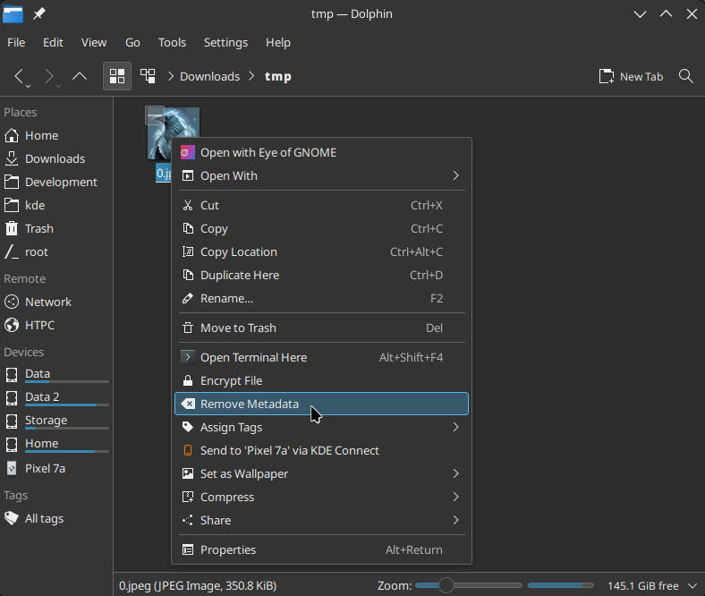
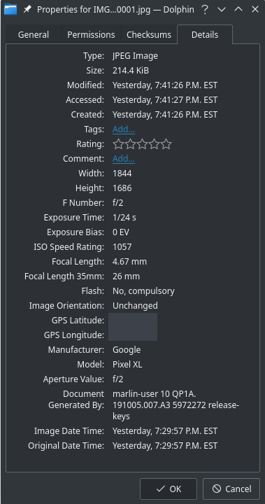
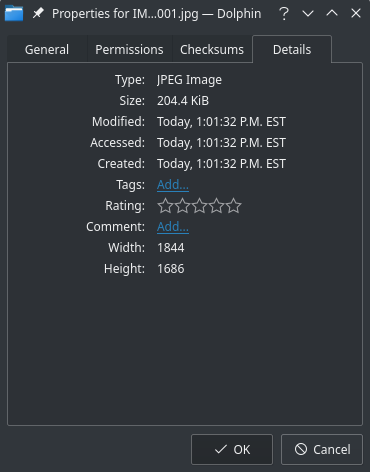

# KDE - Dolphin - Remove Metadata

Adds a right click menu entry to Dolphin to remove all metadata / EXIF data from image files.

This is especially useful to ensure privacy when sharing photos (for example you probably don't want internet people to have your GPS location).

Works with single and multiple images.

 

Requires [ExifTool](https://exiftool.org/) to be installed, for example:

**Ubuntu**

`sudo apt install libimage-exiftool-perl`

**Arch / Manjaro**

`sudo pacman -S perl-image-exiftool`

 

## Screenshots

### Before:

### After:

